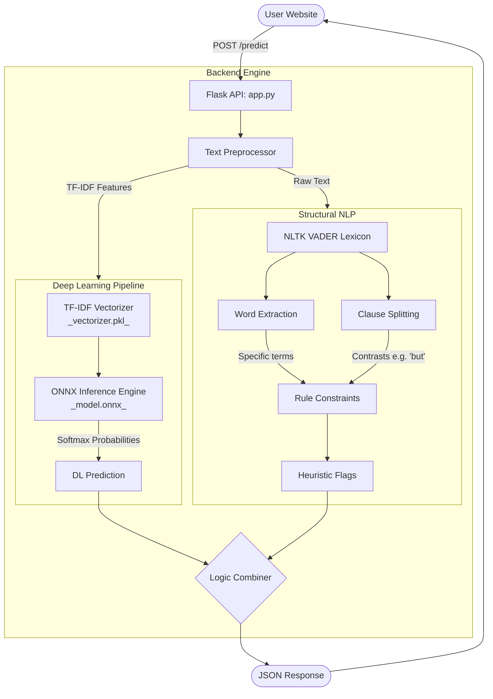
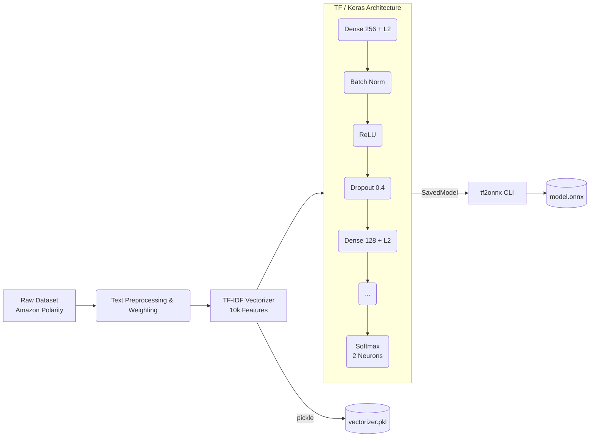

# NLP Sentiment Analysis Engine

A highly optimized dual-pipeline Sentiment Analysis web application. This engine evaluates text to determine whether the sentiment is **Positive**, **Negative**, or **Mixed** by combining Deep Learning with Structural NLP rules.

## 🏗️ System Architecture

Our application runs a hybrid system composed of a Deep Learning (TensorFlow) model for global semantic understanding, and a VADER-based rule heuristic for local clause understanding.



## 🧠 Deep Learning Pipeline (Training)

The model is trained dynamically using `train.py`. The transition to TensorFlow Keras prevents overfitting by enforcing regularization and early stopping criteria.



## 📦 File Structure

- **`app.py`**: The production Flask application serving endpoints and logic.
- **`train.py`**: The standalone training script for generating the AI artifacts.
- **`model.onnx`**: The compiled execution graph of our TensorFlow model.
- **`vectorizer.pkl`**: The fitted mathematical dictionary used for transforming strings into tensors.
- **`requirements.txt`**: Python dependencies.
- **`templates/`**: Holds the frontend application files (`index.html`).
- **`test_app.py`**: Test suite for the application using `pytest`.
- **`Dockerfile`**: Defines the container image for running the app in isolated environments.
- **`Makefile`**: Handy shortcuts for common tasks (e.g. testing, building).
- **`.github/workflows/`**: Continuous Integration (CI) configuration for GitHub Actions.

## ⚙️ MLOps & Testing

This project employs MLOps best practices:
- **CI/CD Pipeline**: GitHub actions are configured to automatically run code checks and tests.
- **Testing**: The test suite covers both unit testing and API endpoint testing. Use `pytest` to run tests locally:
  ```bash
  pytest test_app.py -v
  ```

## 🐳 Docker Deployment

To build and run the application within a Docker container:
```bash
docker build -t nlp_sentiment_app .
docker run -p 5000:5000 nlp_sentiment_app
```

## 🛠️ Make Commands

Use `make` for quick execution of recurring tasks:
- `make run`: Starts the Flask app.
- `make test`: Runs `pytest`.
- `make build`: Builds the Docker image.
- `make docker-run`: Runs the container locally.

## 🚀 Quick Start

1. Ensure Python 3.10 is installed (TensorFlow requirement).
2. Install dependencies:
   ```bash
   pip install -r requirements.txt
   ```
3. Boot the API server:
   ```bash
   python app.py
   ```
4. Access the UI via `http://localhost:5000`
